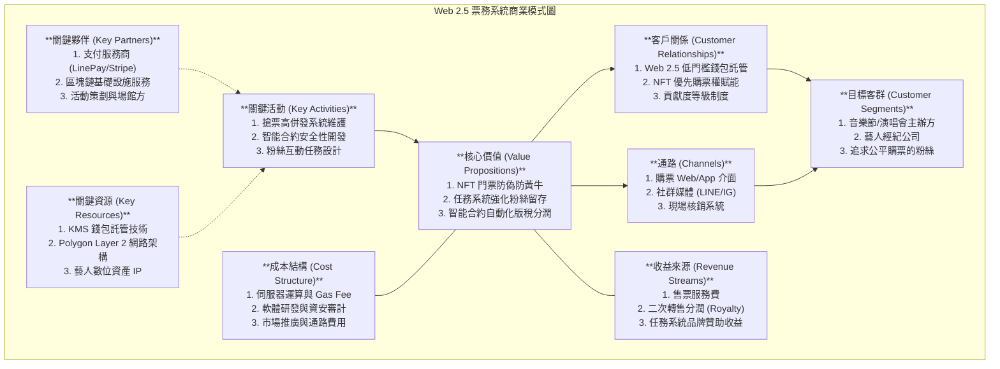

```mermaid
graph TD
    subgraph "Web 2.5 票務系統商業模式圖"
        VP["**核心價值 (Value Propositions)**<br/>1. NFT 門票防偽防黃牛<br/>2. 任務系統強化粉絲留存<br/>3. 智能合約自動化版稅分潤"]
        
        CS["**目標客群 (Customer Segments)**<br/>1. 音樂節/演唱會主辦方<br/>2. 藝人經紀公司<br/>3. 追求公平購票的粉絲"]
        
        REV["**收益來源 (Revenue Streams)**<br/>1. 售票服務費<br/>2. 二次轉售分潤 (Royalty)<br/>3. 任務系統品牌贊助收益"]
        
        CH["**通路 (Channels)**<br/>1. 購票 Web/App 介面<br/>2. 社群媒體 (LINE/IG)<br/>3. 現場核銷系統"]
        
        CR["**客戶關係 (Customer Relationships)**<br/>1. Web 2.5 低門檻錢包託管<br/>2. NFT 優先購票權賦能<br/>3. 貢獻度等級制度"]
        
        KA["**關鍵活動 (Key Activities)**<br/>1. 搶票高併發系統維護<br/>2. 智能合約安全性開發<br/>3. 粉絲互動任務設計"]
        
        KR["**關鍵資源 (Key Resources)**<br/>1. KMS 錢包託管技術<br/>2. Polygon Layer 2 網路架構<br/>3. 藝人數位資產 IP"]
        
        KP["**關鍵夥伴 (Key Partners)**<br/>1. 支付服務商 (LinePay/Stripe)<br/>2. 區塊鏈基礎設施服務<br/>3. 活動策劃與場館方"]
        
        COST["**成本結構 (Cost Structure)**<br/>1. 伺服器運算與 Gas Fee<br/>2. 軟體研發與資安審計<br/>3. 市場推廣與通路費用"]
    end

    KP -.-> KA
    KR -.-> KA
    KA --> VP
    VP --> CR
    CR --> CS
    VP --> CH
    CH --> CS
    COST --- VP
    VP --- REV
```
