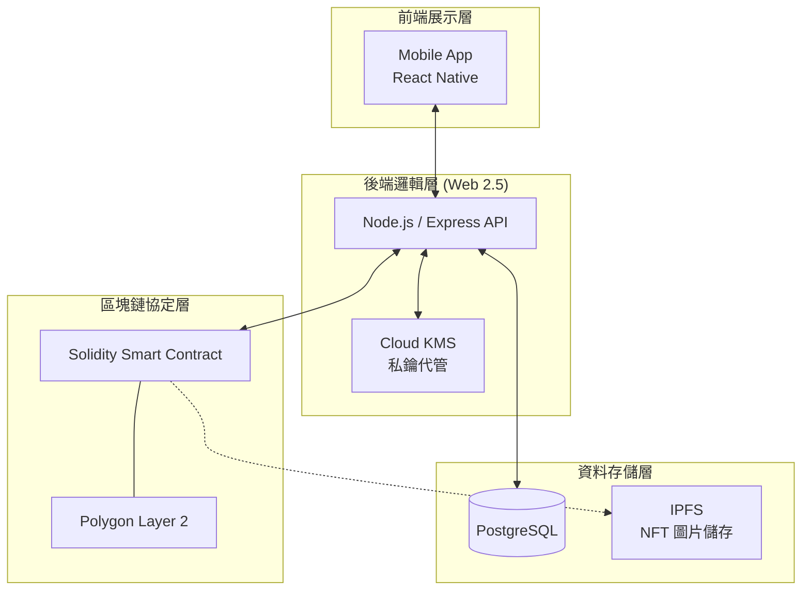

```mermaid
graph TD
    subgraph Frontend ["前端展示層"]
        App[Mobile App<br/>React Native]
    end

    subgraph Backend ["後端邏輯層 (Web 2.5)"]
        API[Node.js / Express API]
        KMS[Cloud KMS<br/>私鑰代管]
    end

    subgraph Storage ["資料存儲層"]
        DB[(PostgreSQL)]
        IPFS[IPFS<br/>NFT 圖片儲存]
    end

    subgraph Blockchain ["區塊鏈協定層"]
        SC[Solidity Smart Contract]
        BC[Polygon Layer 2]
    end

    %% 連線邏輯
    App <--> API
    API <--> DB
    API <--> KMS
    API <--> SC
    SC --- BC
    SC -.-> IPFS
```
