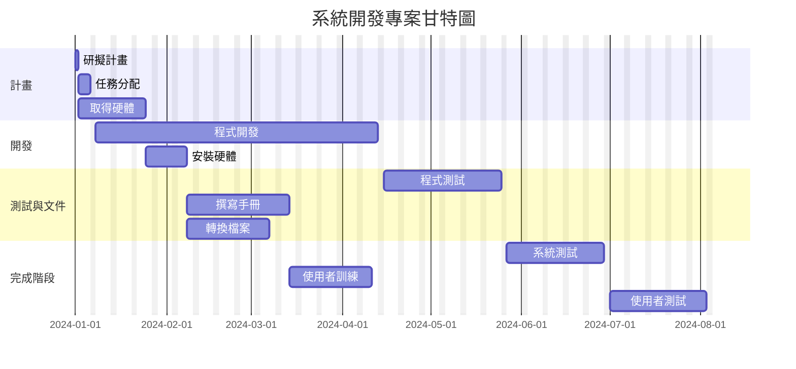
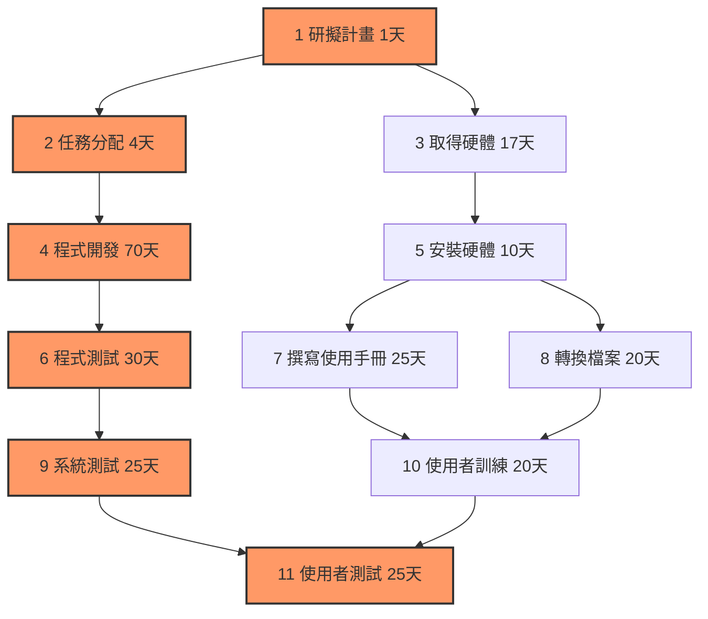

# (1)PERT/CPM 圖和(2)甘特圖以及(3)關鍵路徑

## 甘特圖

```mermaid
gantt
    dateFormat  YYYY-MM-DD
    title 系統開發專案甘特圖
    excludes weekends

    section 計畫
    研擬計畫       :a1, 2024-01-01, 1d
    任務分配       :a2, after a1, 4d
    取得硬體       :a3, after a1, 17d

    section 開發
    程式開發       :a4, after a2, 70d
    安裝硬體       :a5, after a3, 10d

    section 測試與文件
    程式測試       :a6, after a4, 30d
    撰寫手冊       :a7, after a5, 25d
    轉換檔案       :a8, after a5, 20d

    section 完成階段
    系統測試       :a9, after a6, 25d
    使用者訓練     :a10, after a7 a8, 20d
    使用者測試     :a11, after a9 a10, 25d
```

```mermaid  
graph TD
    T1[1 研擬計畫 1天]:::critical
    T2[2 任務分配 4天]:::critical
    T3[3 取得硬體 17天]
    T4[4 程式開發 70天]:::critical
    T5[5 安裝硬體 10天]
    T6[6 程式測試 30天]:::critical
    T7[7 撰寫使用手冊 25天]
    T8[8 轉換檔案 20天]
    T9[9 系統測試 25天]:::critical
    T10[10 使用者訓練 20天]
    T11[11 使用者測試 25天]:::critical

    classDef critical fill:#f96,stroke:#333,stroke-width:2px;

    T1 --> T2
    T1 --> T3
    T2 --> T4
    T3 --> T5
    T4 --> T6
    T5 --> T7
    T5 --> T8
    T6 --> T9
    T7 --> T10
    T8 --> T10
    T9 --> T11
    T10 --> T11
```
