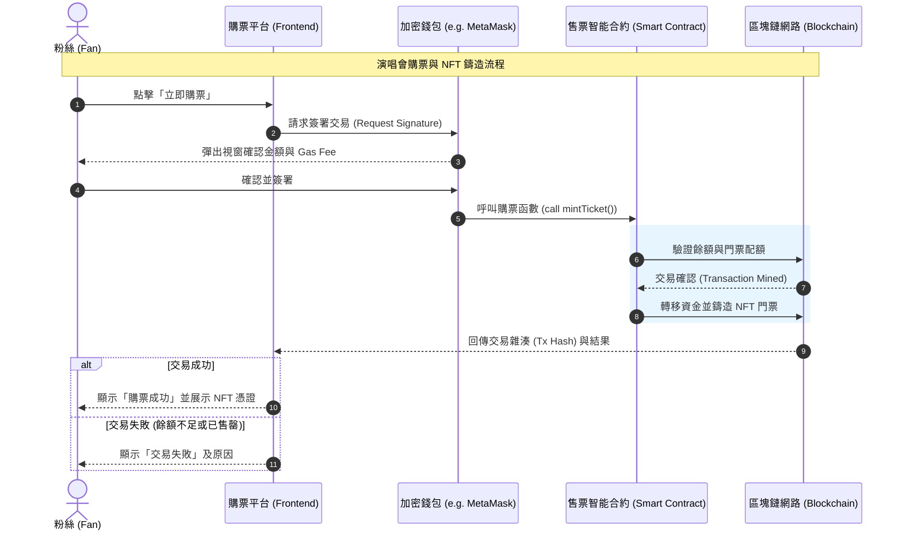

```mermaid

sequenceDiagram
    autonumber
    actor Fan as 粉絲 (Fan)
    participant FE as 購票平台 (Frontend)
    participant Wallet as 加密錢包 (e.g. MetaMask)
    participant SC as 售票智能合約 (Smart Contract)
    participant BC as 區塊鏈網路 (Blockchain)

    Note over Fan, BC: 演唱會購票與 NFT 鑄造流程

    Fan->>FE: 點擊「立即購票」
    FE->>Wallet: 請求簽署交易 (Request Signature)
    Wallet-->>Fan: 彈出視窗確認金額與 Gas Fee
    
    Fan->>Wallet: 確認並簽署
    Wallet->>SC: 呼叫購票函數 (call mintTicket())
    
    rect rgb(230, 245, 255)
        SC->>BC: 驗證餘額與門票配額
        BC-->>SC: 交易確認 (Transaction Mined)
        SC->>BC: 轉移資金並鑄造 NFT 門票
    end

    BC-->>FE: 回傳交易雜湊 (Tx Hash) 與結果
    
    alt 交易成功
        FE-->>Fan: 顯示「購票成功」並展示 NFT 憑證
    else 交易失敗 (餘額不足或已售罄)
        FE-->>Fan: 顯示「交易失敗」及原因
    end

```
