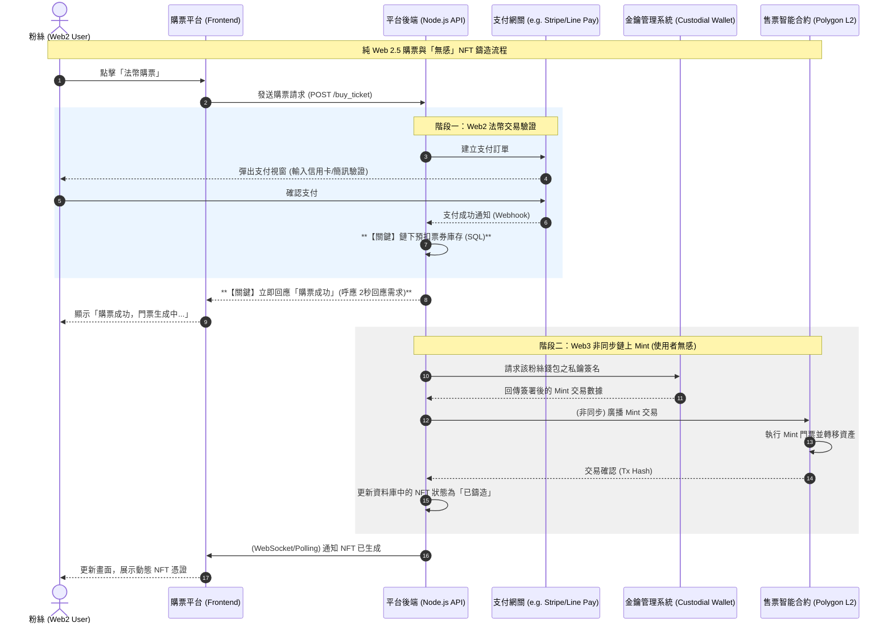

```mermaid

sequenceDiagram
    autonumber
    actor Fan as 粉絲 (Web2 User)
    participant FE as 購票平台 (Frontend)
    participant Backend as 平台後端 (Node.js API)
    participant Pay as 支付網關 (e.g. Stripe/Line Pay)
    participant KMS as 金鑰管理系統 (Custodial Wallet)
    participant SC as 售票智能合約 (Polygon L2)

    Note over Fan, SC: 純 Web 2.5 購票與「無感」NFT 鑄造流程

    Fan->>FE: 點擊「法幣購票」
    FE->>Backend: 發送購票請求 (POST /buy_ticket)
    
    rect rgb(235, 245, 255)
        Note over Backend, Pay: 階段一：Web2 法幣交易驗證
        Backend->>Pay: 建立支付訂單
        Pay-->>Fan: 彈出支付視窗 (輸入信用卡/簡訊驗證)
        Fan->>Pay: 確認支付
        Pay-->>Backend: 支付成功通知 (Webhook)
        Backend->>Backend: **【關鍵】鏈下預扣票券庫存 (SQL)**
    end

    Backend-->>FE: **【關鍵】立即回應「購票成功」(呼應 2秒回應需求)**
    FE-->>Fan: 顯示「購票成功，門票生成中...」

    rect rgb(240, 240, 240)
        Note over Backend, SC: 階段二：Web3 非同步鏈上 Mint (使用者無感)
        Backend->>KMS: 請求該粉絲錢包之私鑰簽名
        KMS-->>Backend: 回傳簽署後的 Mint 交易數據
        Backend->>SC: (非同步) 廣播 Mint 交易
        SC->>SC: 執行 Mint 門票並轉移資產
        SC-->>Backend: 交易確認 (Tx Hash)
        Backend->>Backend: 更新資料庫中的 NFT 狀態為「已鑄造」
    end

    Backend->>FE: (WebSocket/Polling) 通知 NFT 已生成
    FE-->>Fan: 更新畫面，展示動態 NFT 憑證

```
